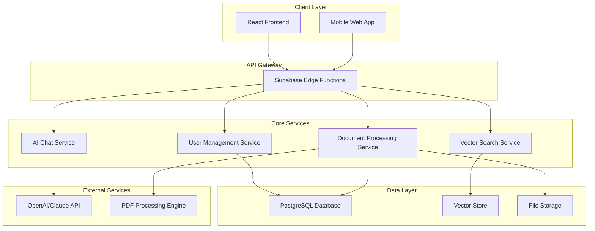
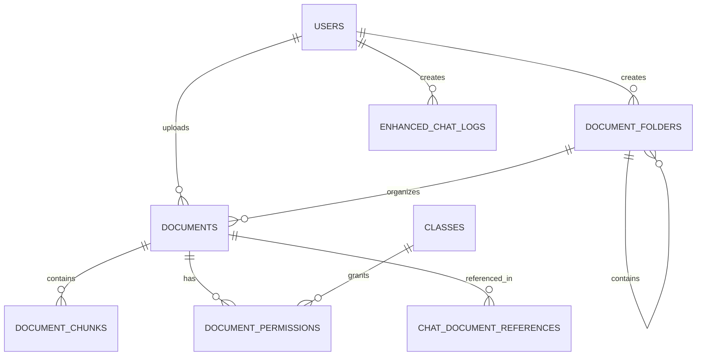
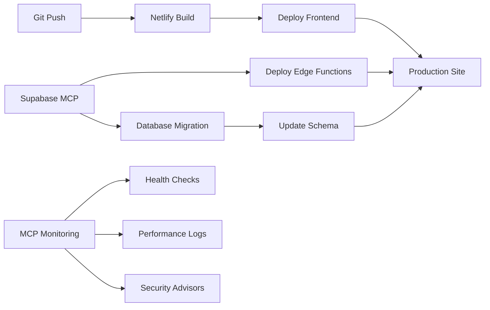

# Design Document

## Overview

The Enhanced RAG System is a comprehensive AI education platform that significantly improves upon existing document processing and retrieval capabilities. The system provides seamless PDF upload, advanced document management, intelligent search, and contextual AI conversations. Built on a modern React/TypeScript frontend with Supabase backend, the platform ensures scalability, security, and excellent user experience across all devices.

## Architecture

### High-Level Architecture



### System Components

1. **Frontend Application**: React-based SPA with mobile-first responsive design (deployed on Netlify)
2. **API Layer**: Supabase Edge Functions for serverless processing
3. **Document Processing Pipeline**: Asynchronous PDF processing with queue management
4. **Vector Search Engine**: Optimized semantic search with hybrid retrieval
5. **AI Integration Layer**: Multi-provider AI service with context management
6. **Real-time Communication**: WebSocket-based status updates and chat
7. **New Database**: Fresh Supabase project with enhanced schema design
8. **Deployment Pipeline**: Netlify for frontend, Supabase for backend services
9. **Database Management**: Supabase MCP for database operations and monitoring

**Updated Supabase MCP Integration (2025-01-11):**
- **Available MCP Tools**: `list_tables`, `list_extensions`, `list_migrations`, `apply_migration`, `execute_sql`, `get_logs`, `get_advisors`, `generate_typescript_types`, `deploy_edge_function`, `list_edge_functions`
- **Branch Management**: `create_branch`, `list_branches`, `delete_branch`, `merge_branch`, `reset_branch`, `rebase_branch` (experimental, requires paid plan)
- **Development Workflow**: Full migration tracking, development branch isolation, production deployment pipeline
- **Security Modes**: Read-only mode for safe operations, full-access mode for development
- **Real-time Monitoring**: Log access, advisory notices, performance monitoring

## Components and Interfaces

### Frontend Components

#### Document Management Interface
```typescript
interface DocumentManagerProps {
  documents: Document[];
  onUpload: (files: File[]) => Promise<void>;
  onDelete: (documentId: string) => Promise<void>;
  onOrganize: (documentId: string, folderId: string) => Promise<void>;
  permissions: DocumentPermissions;
}

interface Document {
  id: string;
  title: string;
  filename: string;
  size: number;
  uploadDate: Date;
  processingStatus: ProcessingStatus;
  language: string;
  folderId?: string;
  permissions: AccessLevel[];
}

enum ProcessingStatus {
  UPLOADING = 'uploading',
  EXTRACTING = 'extracting',
  CHUNKING = 'chunking',
  EMBEDDING = 'embedding',
  COMPLETED = 'completed',
  FAILED = 'failed'
}
```

#### Enhanced Chat Interface
```typescript
interface EnhancedChatProps {
  availableDocuments: Document[];
  chatHistory: ChatMessage[];
  onSendMessage: (message: string) => Promise<void>;
  onClearHistory: () => void;
  isLoading: boolean;
}

interface ChatMessage {
  id: string;
  content: string;
  role: 'user' | 'assistant';
  timestamp: Date;
  documentReferences?: DocumentReference[];
  confidence?: number;
}

interface DocumentReference {
  documentId: string;
  documentTitle: string;
  pageNumber?: number;
  chunkId: string;
  relevanceScore: number;
  excerpt: string;
}
```

### Backend Services

#### Document Processing Service
```typescript
interface DocumentProcessor {
  processDocument(file: File, userId: string): Promise<ProcessingResult>;
  getProcessingStatus(documentId: string): Promise<ProcessingStatus>;
  retryProcessing(documentId: string): Promise<void>;
}

interface ProcessingResult {
  documentId: string;
  chunks: DocumentChunk[];
  embeddings: number[][];
  metadata: DocumentMetadata;
  processingTime: number;
}

interface DocumentChunk {
  id: string;
  content: string;
  pageNumber: number;
  position: ChunkPosition;
  embedding: number[];
  metadata: ChunkMetadata;
}
```

#### Vector Search Service
```typescript
interface VectorSearchService {
  search(query: string, options: SearchOptions): Promise<SearchResult[]>;
  hybridSearch(query: string, keywords: string[], options: SearchOptions): Promise<SearchResult[]>;
  addDocumentEmbeddings(documentId: string, embeddings: DocumentEmbedding[]): Promise<void>;
  removeDocumentEmbeddings(documentId: string): Promise<void>;
}

interface SearchOptions {
  documentIds?: string[];
  maxResults?: number;
  minSimilarity?: number;
  includeMetadata?: boolean;
  language?: string;
}

interface SearchResult {
  chunkId: string;
  documentId: string;
  content: string;
  similarity: number;
  metadata: ChunkMetadata;
}
```

#### AI Chat Service
```typescript
interface AIChatService {
  generateResponse(
    message: string, 
    context: DocumentContext[], 
    chatHistory: ChatMessage[]
  ): Promise<AIResponse>;
  
  streamResponse(
    message: string, 
    context: DocumentContext[], 
    onChunk: (chunk: string) => void
  ): Promise<void>;
}

interface DocumentContext {
  content: string;
  source: DocumentReference;
  relevance: number;
}

interface AIResponse {
  content: string;
  sources: DocumentReference[];
  confidence: number;
  processingTime: number;
}
```

## Data Models

### Database Schema

#### Documents Table
```sql
CREATE TABLE documents (
  id UUID PRIMARY KEY DEFAULT gen_random_uuid(),
  user_id UUID REFERENCES auth.users(id) ON DELETE CASCADE,
  title TEXT NOT NULL,
  filename TEXT NOT NULL,
  file_path TEXT NOT NULL,
  file_size BIGINT NOT NULL,
  mime_type TEXT NOT NULL,
  language TEXT DEFAULT 'auto',
  processing_status processing_status_enum DEFAULT 'uploading',
  folder_id UUID REFERENCES document_folders(id),
  created_at TIMESTAMPTZ DEFAULT NOW(),
  updated_at TIMESTAMPTZ DEFAULT NOW(),
  processed_at TIMESTAMPTZ,
  metadata JSONB DEFAULT '{}'::jsonb
);

CREATE INDEX idx_documents_user_id ON documents(user_id);
CREATE INDEX idx_documents_status ON documents(processing_status);
CREATE INDEX idx_documents_folder ON documents(folder_id);
```

#### Document Chunks Table
```sql
CREATE TABLE document_chunks (
  id UUID PRIMARY KEY DEFAULT gen_random_uuid(),
  document_id UUID REFERENCES documents(id) ON DELETE CASCADE,
  chunk_index INTEGER NOT NULL,
  content TEXT NOT NULL,
  page_number INTEGER,
  position_start INTEGER,
  position_end INTEGER,
  embedding vector(1536), -- OpenAI embedding dimension
  metadata JSONB DEFAULT '{}'::jsonb,
  created_at TIMESTAMPTZ DEFAULT NOW()
);

CREATE INDEX idx_chunks_document ON document_chunks(document_id);
CREATE INDEX idx_chunks_embedding ON document_chunks USING ivfflat (embedding vector_cosine_ops);
```

#### Document Folders Table
```sql
CREATE TABLE document_folders (
  id UUID PRIMARY KEY DEFAULT gen_random_uuid(),
  user_id UUID REFERENCES auth.users(id) ON DELETE CASCADE,
  name TEXT NOT NULL,
  parent_id UUID REFERENCES document_folders(id),
  created_at TIMESTAMPTZ DEFAULT NOW(),
  UNIQUE(user_id, name, parent_id)
);
```

#### Document Permissions Table
```sql
CREATE TABLE document_permissions (
  id UUID PRIMARY KEY DEFAULT gen_random_uuid(),
  document_id UUID REFERENCES documents(id) ON DELETE CASCADE,
  class_id UUID REFERENCES classes(id) ON DELETE CASCADE,
  permission_level permission_level_enum DEFAULT 'read',
  granted_by UUID REFERENCES auth.users(id),
  created_at TIMESTAMPTZ DEFAULT NOW(),
  UNIQUE(document_id, class_id)
);
```

#### Enhanced Chat Logs Table
```sql
CREATE TABLE enhanced_chat_logs (
  id UUID PRIMARY KEY DEFAULT gen_random_uuid(),
  user_id UUID REFERENCES auth.users(id) ON DELETE CASCADE,
  session_id UUID NOT NULL,
  message TEXT NOT NULL,
  role message_role_enum NOT NULL,
  document_references JSONB DEFAULT '[]'::jsonb,
  confidence_score DECIMAL(3,2),
  processing_time_ms INTEGER,
  created_at TIMESTAMPTZ DEFAULT NOW()
);

CREATE INDEX idx_chat_logs_user_session ON enhanced_chat_logs(user_id, session_id);
CREATE INDEX idx_chat_logs_created ON enhanced_chat_logs(created_at);
```

### Data Relationships



## Error Handling

### Error Categories and Responses

#### Document Processing Errors
```typescript
enum DocumentProcessingError {
  INVALID_FILE_FORMAT = 'INVALID_FILE_FORMAT',
  FILE_TOO_LARGE = 'FILE_TOO_LARGE',
  EXTRACTION_FAILED = 'EXTRACTION_FAILED',
  EMBEDDING_FAILED = 'EMBEDDING_FAILED',
  STORAGE_ERROR = 'STORAGE_ERROR'
}

interface ErrorResponse {
  code: string;
  message: string;
  details?: any;
  retryable: boolean;
  suggestedAction?: string;
}
```

#### Error Handling Strategy
1. **Client-Side Validation**: File type, size, format validation before upload
2. **Graceful Degradation**: Fallback to basic search when vector search fails
3. **Retry Mechanisms**: Automatic retry for transient failures with exponential backoff
4. **User Feedback**: Clear error messages with actionable suggestions
5. **Logging**: Comprehensive error logging for debugging and monitoring

### Error Recovery Patterns
```typescript
class DocumentProcessingService {
  async processWithRetry(document: Document, maxRetries = 3): Promise<ProcessingResult> {
    for (let attempt = 1; attempt <= maxRetries; attempt++) {
      try {
        return await this.processDocument(document);
      } catch (error) {
        if (attempt === maxRetries || !this.isRetryableError(error)) {
          throw error;
        }
        await this.delay(Math.pow(2, attempt) * 1000); // Exponential backoff
      }
    }
  }
}
```

## Testing Strategy

### Unit Testing
- **Component Testing**: React components with React Testing Library
- **Service Testing**: Business logic and API integration tests
- **Utility Testing**: Helper functions and data transformations

### Integration Testing
- **API Testing**: Edge Functions with mock data
- **Database Testing**: Schema validation and query performance
- **File Processing Testing**: PDF extraction and embedding generation

### End-to-End Testing
- **User Workflows**: Complete document upload and chat scenarios
- **Cross-Browser Testing**: Compatibility across major browsers
- **Mobile Testing**: Touch interactions and responsive behavior

### Performance Testing
- **Load Testing**: Concurrent user scenarios
- **Document Processing**: Large file handling and processing times
- **Search Performance**: Vector search response times under load

### Testing Tools and Framework
```typescript
// Jest configuration for comprehensive testing
module.exports = {
  testEnvironment: 'jsdom',
  setupFilesAfterEnv: ['<rootDir>/src/test/setup.ts'],
  moduleNameMapping: {
    '^@/(.*)$': '<rootDir>/src/$1'
  },
  collectCoverageFrom: [
    'src/**/*.{ts,tsx}',
    '!src/**/*.d.ts',
    '!src/test/**/*'
  ],
  coverageThreshold: {
    global: {
      branches: 80,
      functions: 80,
      lines: 80,
      statements: 80
    }
  }
};
```

## Security Considerations

### Authentication and Authorization
- **JWT Token Management**: Secure token storage and automatic refresh
- **Role-Based Access Control**: Granular permissions for documents and features
- **Session Management**: Secure session handling with timeout policies

### Data Protection
- **Encryption at Rest**: Document content and embeddings encryption
- **Encryption in Transit**: HTTPS/WSS for all communications
- **PII Handling**: Anonymization of sensitive data in analytics

### Input Validation and Sanitization
```typescript
interface DocumentUploadValidator {
  validateFile(file: File): ValidationResult;
  sanitizeFilename(filename: string): string;
  checkFileIntegrity(file: File): Promise<boolean>;
}

const ALLOWED_MIME_TYPES = ['application/pdf'];
const MAX_FILE_SIZE = 50 * 1024 * 1024; // 50MB
const FILENAME_REGEX = /^[a-zA-Z0-9._-]+$/;
```

### API Security
- **Rate Limiting**: Per-user and per-endpoint limits
- **CORS Configuration**: Strict origin policies
- **Input Sanitization**: SQL injection and XSS prevention
- **Audit Logging**: Comprehensive access and action logging

## Performance Optimization

### Frontend Optimization
- **Code Splitting**: Route-based and component-based splitting
- **Lazy Loading**: Progressive loading of heavy components
- **Memoization**: React.memo and useMemo for expensive operations
- **Virtual Scrolling**: Efficient rendering of large document lists

### Backend Optimization
- **Database Indexing**: Optimized indexes for common queries
- **Connection Pooling**: Efficient database connection management
- **Caching Strategy**: Redis caching for frequently accessed data
- **Async Processing**: Background jobs for document processing

### Vector Search Optimization
```sql
-- Optimized vector search with pre-filtering
CREATE OR REPLACE FUNCTION search_documents_optimized(
  query_embedding vector(1536),
  user_accessible_docs UUID[],
  similarity_threshold FLOAT DEFAULT 0.7,
  max_results INTEGER DEFAULT 10
)
RETURNS TABLE (
  chunk_id UUID,
  document_id UUID,
  content TEXT,
  similarity FLOAT
) AS $$
BEGIN
  RETURN QUERY
  SELECT 
    dc.id,
    dc.document_id,
    dc.content,
    1 - (dc.embedding <=> query_embedding) as similarity
  FROM document_chunks dc
  JOIN documents d ON dc.document_id = d.id
  WHERE d.id = ANY(user_accessible_docs)
    AND d.processing_status = 'completed'
    AND 1 - (dc.embedding <=> query_embedding) > similarity_threshold
  ORDER BY dc.embedding <=> query_embedding
  LIMIT max_results;
END;
$$ LANGUAGE plpgsql;
```

### Mobile Performance
- **Progressive Web App**: Service worker for offline capabilities
- **Image Optimization**: Responsive images and lazy loading
- **Touch Optimization**: Optimized touch targets and gestures
- **Network Awareness**: Adaptive loading based on connection quality

## Scalability Design

### Horizontal Scaling
- **Microservices Architecture**: Independent scaling of services
- **Load Balancing**: Distribution of requests across instances
- **Database Sharding**: Partitioning strategies for large datasets
- **CDN Integration**: Global content distribution

### Vertical Scaling
- **Resource Optimization**: Efficient memory and CPU usage
- **Database Optimization**: Query optimization and indexing
- **Caching Layers**: Multi-level caching strategy
- **Background Processing**: Async job queues for heavy operations

### Monitoring and Observability
```typescript
interface SystemMetrics {
  documentProcessingTime: number;
  searchResponseTime: number;
  activeUsers: number;
  errorRate: number;
  throughput: number;
}

interface AlertThresholds {
  maxResponseTime: number;
  maxErrorRate: number;
  minAvailability: number;
}
```

## Deployment and Infrastructure

### New Project Setup
- **Fresh Git Repository**: Complete separation from existing codebase
- **New Supabase Project**: Clean database with enhanced schema design
- **Netlify Deployment**: Modern frontend hosting with automatic deployments

### Environment Configuration
```typescript
// Environment variables for different stages
interface EnvironmentConfig {
  // Supabase Configuration
  VITE_SUPABASE_URL: string;
  VITE_SUPABASE_ANON_KEY: string;
  
  // AI Service Configuration
  OPENAI_API_KEY: string;
  ANTHROPIC_API_KEY: string;
  
  // Deployment Configuration
  NETLIFY_SITE_ID: string;
  NODE_ENV: 'development' | 'staging' | 'production';
}

// Supabase MCP Configuration
interface SupabaseMCPConfig {
  projectRef: string;
  accessToken: string;
  dbPassword: string;
  enableRealtime: boolean;
  enableVectorExtension: boolean;
}
```

### Deployment Pipeline


### Supabase MCP Integration

#### Database Management via MCP (Updated 2025-01-11)
```typescript
// Complete MCP functions for database operations based on latest documentation
interface SupabaseMCPOperations {
  // Database Schema Management
  listTables(schemas?: string[]): Promise<Table[]>;
  listExtensions(): Promise<Extension[]>;
  listMigrations(): Promise<Migration[]>;
  applyMigration(name: string, query: string): Promise<void>;
  executeSql(query: string): Promise<QueryResult>;
  generateTypescriptTypes(): Promise<string>;
  
  // Edge Functions Management
  listEdgeFunctions(): Promise<EdgeFunction[]>;
  getEdgeFunction(functionSlug: string): Promise<EdgeFunctionContent>;
  deployEdgeFunction(name: string, files: EdgeFunctionFile[]): Promise<void>;
  
  // Development Branch Management (Experimental - Requires Paid Plan)
  createBranch(branchName: string, sourceBranch?: string): Promise<void>;
  listBranches(): Promise<Branch[]>;
  deleteBranch(branchName: string): Promise<void>;
  mergeBranch(sourceBranch: string, targetBranch: string): Promise<void>;
  resetBranch(branchName: string, targetVersion: string): Promise<void>;
  rebaseBranch(branchName: string, sourceBranch?: string): Promise<void>;
  
  // Monitoring & Debugging
  getLogs(service: 'api' | 'postgres' | 'edge-function' | 'auth' | 'storage' | 'realtime'): Promise<LogEntry[]>;
  getAdvisors(type: 'security' | 'performance'): Promise<Advisory[]>;
  
  // Project Information
  getProjectUrl(): Promise<string>;
  getAnonKey(): Promise<string>;
  
  // Documentation Search
  searchDocs(query: string): Promise<DocSearchResult[]>;
}
```

#### MCP-Driven Development Workflow
1. **Schema Evolution**: Use MCP migrations for database schema changes
2. **Function Deployment**: Deploy Edge Functions through MCP tools
3. **Real-time Monitoring**: Monitor system health via MCP logs and advisors
4. **Type Safety**: Generate TypeScript types automatically from schema
5. **Security Auditing**: Regular security checks through MCP advisors

#### Benefits of MCP Integration
- **Streamlined Development**: Direct database operations from development environment
- **Real-time Monitoring**: Immediate access to logs and performance metrics
- **Automated Type Generation**: Always up-to-date TypeScript types
- **Security Compliance**: Continuous security advisory monitoring
- **Simplified Deployment**: Unified deployment pipeline for all Supabase resources

### Infrastructure Benefits
1. **Clean Start**: No legacy code or database constraints
2. **Modern Deployment**: Netlify's advanced features and CDN
3. **Scalable Backend**: New Supabase project with optimized configuration
4. **Independent Development**: Separate from existing system for parallel development
5. **MCP-Enhanced Workflow**: Streamlined database management and monitoring

This design provides a comprehensive foundation for building an enhanced RAG system from scratch, with modern deployment infrastructure, Supabase MCP integration, and significantly improved capabilities over the existing platform.